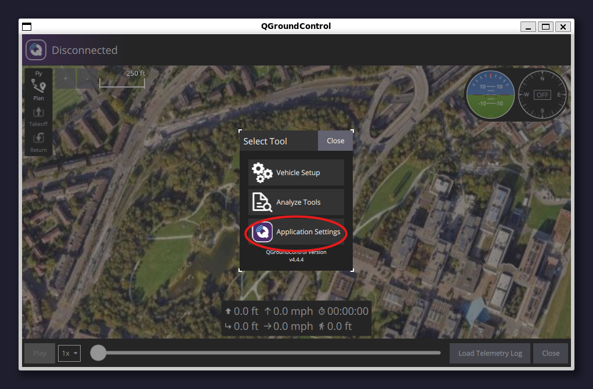
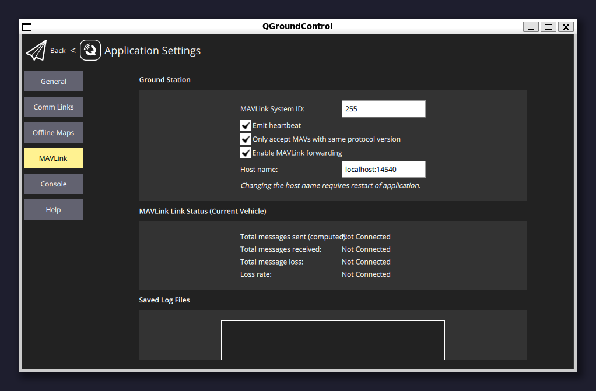

# Installation / Setup

## Prerequisites

* Must be using Ubuntu 22.04 LTS.
* Ensure that you have the following packages installed via apt
  * git
  * wget
  * curl
  * make
  * build-essential
  * python
  * pip
* Sudo permissions

## Installing PX4

To install PX4, follow the steps of this website:




Please follow the instructions for the [Gazebo Simulator](https://docs.px4.io/main/en/sim_gazebo_gz/) ("Harmonic") on Ubuntu 22.04 target


## Installing ROS2

To install ROS2, follow the steps on this website:




Please follow the instructions for ROS2 "Humble"


## Installing QGroundControl

To install QGroundControl, follow the steps on this website:




Please ensure that you are downloading QGroundControl in the user directory. To ensure this please type "cd \~" in your terminal.


## Installing PlotJuggler

To install PlotJuggler, copy and paste this command into your terminal.

```bash
sudo snap install plotjuggler
```

## Installing MAVROS

To install MAVROS follow these commands.

```bash
sudo apt install ros-humble-mavros ros-humble-mavros-extras
wget https://raw.githubusercontent.com/mavlink/mavros/ros2/mavros/scripts/install_geographiclib_datasets.sh
sudo sh install_geographiclib_datasets.sh
```

## Enabling Port Forwarding on QGroundControl

To use MAVROS, you need to enable port forwarding in QGroundControl. Please launch QGroundControl with the following command.

```bash
cd ~
./QGroundControl.AppImage
```

Then follow the steps on the screenshots to enable port forwardng.

<figure><figcaption></figcaption></figure>

<figure><figcaption></figcaption></figure>

<figure><figcaption></figcaption></figure>

<figure><figcaption></figcaption></figure>

You can now close this window

## Testing

Please create four terminal windows and run the following commands in each window.

### Terminal 1 (PX4 and Gazebo Environment)

```bash
cd PX4-Autopilot/
make px4_sitl gz_x500
```

### Terminal 2 (QGroundControl)

```bash
cd ~
../QGroundControl.AppImage
```

### Terminal 3 (MAVROS)

```bash
ros2 run mavros mavros_node --ros-args -p fcu_url:=udp://:14540@127.0.0.1:14557 -p target_component_id:=1 -r __ns:=/mavros
```

### Terminal 4 (PlotJuggler)

```bash
plotjuggler
```

### PlotJuggler

To receive the live data please click the start button under Streaming on the left side of your screen.

<figure><figcaption></figcaption></figure>


Please ensure that you have "ROS Topic Subscriber" selected.

