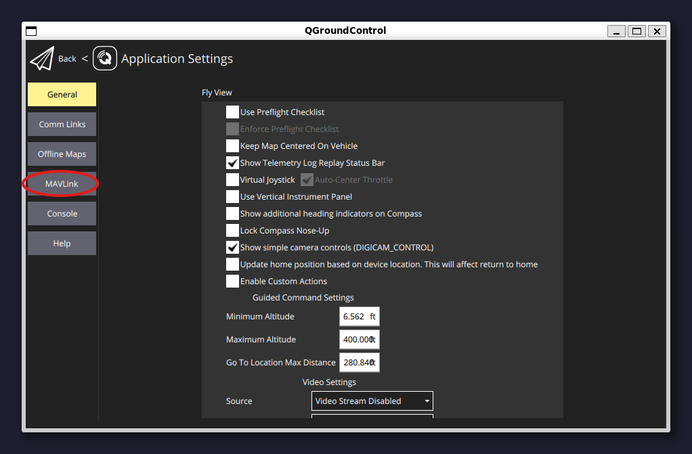
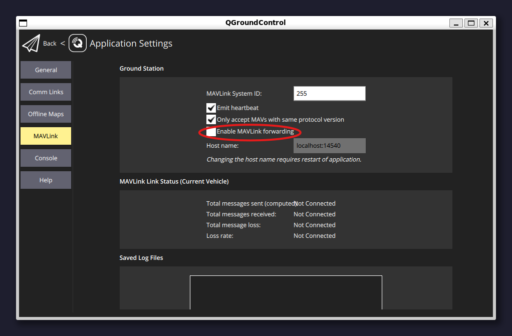
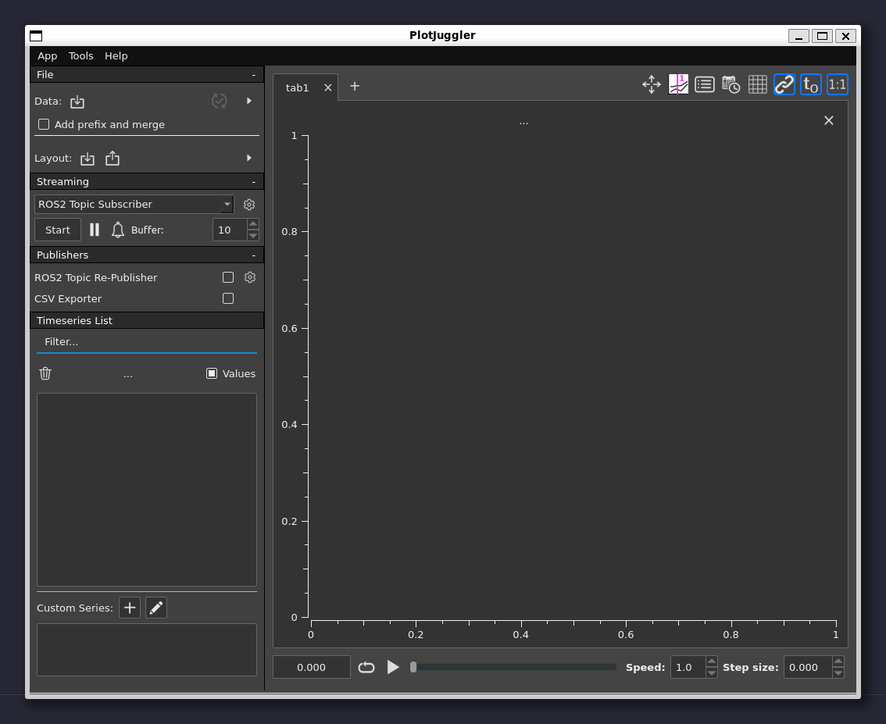

# Installation / Setup

## Prerequisites

Ensure the following requirements are met before proceeding:

1. **Operating System**: Ubuntu 22.04 LTS.
2. **Sudo Permissions**: Ensure you have administrative privileges.
3.  **Required Packages**: Install these via `apt`:

    ```bash
    sudo apt update && sudo apt install git wget curl make build-essential python3 python3-pip
    ```

***


## NOTE: Some commands may require user verification. When executing these commands please ensure that you accept or continue when prompted.


## Step 1: Installing PX4 and ROS 2

1. **Set Up PX4 Environment**:
   1. Navigate to the "[Install PX4](https://docs.px4.io/main/en/ros2/user_guide.html#install-px4)" header
   2. Scroll down to "Set up a PX4 development environment on Ubuntu."
      1. Copy and paste the provided command block.
2. **Download and Install ROS2**:
   * Navigate to the "[Install ROS 2](https://docs.px4.io/main/en/ros2/user_guide.html#install-px4)" section.
   * Follow steps one and two to install ROS 2 Humble. Note: This may take a few minutes.

Stop at the "Setup Micro XRCE-DDS Agent & Client" section

***

## Step 2: Install MAVROS

To install MAVROS, follow these installation [instructions](https://github.com/mavlink/mavros/blob/ros2/mavros/README.md#installation).&#x20;

In my case I had to run the following commands below:

```bash
cd ~
sudo apt install ros-humble-mavros ros-humble-mavros-extras
wget https://raw.githubusercontent.com/mavlink/mavros/ros2/mavros/scripts/install_geographiclib_datasets.sh
sudo sh install_geographiclib_datasets.sh
```

***

## Step 3: Download QGroundControl

Navigate to the [Ubuntu Linux](https://docs.qgroundcontrol.com/master/en/qgc-user-guide/getting_started/download_and_install.html#ubuntu) section and follow the steps all the way to the Android section.

Provided below is a copy of the commands I had to execute:

```bash
# Downloading the x86_64 QGroundControl
cd ~
curl -O https://d176tv9ibo4jno.cloudfront.net/builds/master/QGroundControl-x86_64.AppImage

# Making the file executable
chmod +x QGroundControl-x86_64.AppImage

# Giving user dialout permissions
sudo usermod -a -G dialout $USER
sudo apt-get remove modemmanager -y
```

Then reboot your system so the user permissions changes take effect

***

## Step 4: Enable Port Forwarding in QGroundControl

To enable port forwarding in QGroundControl:

1.  Launch QGroundControl:

    ```bash
    cd ~
    ./QGroundControl-x86_64.AppImage
    ```
2.  Follow the steps shown in the screenshots below to enable port forwarding:

       


Due to a recent QGroundControl UI update, the MAVLINK forwarding configuration has been moved to the telemetry tab.


You can now close QGroundControl

***

## Step 5 (Option 1): Install PlotJuggler

Install PlotJuggler via the install [instructions](https://github.com/facontidavide/PlotJuggler?tab=readme-ov-file#installation) for Ubuntu 22.04 with ROS2 support.

In my case I had to run the command below:

```bash
sudo snap install plotjuggler
```

***

## Step 5 (Option 2): Setup Foxglove

### Part 1: Installing Foxglove Desktop

To install Foxglove use the instructions below:



In my case, I had to run the following commands below

```bash
cd ~/Downloads
sudo apt install ./foxglove-studio-*.deb
sudo apt update && sudo apt install foxglove-studio
```

### Part 2:  Installing Foxglove Bridge

Follow the directions linked below to install Foxglove bridge.



In my case I ran this command:

```bash
sudo apt install ros-humble-foxglove-bridge
```

***

## Step 6: Testing the Setup

Open four terminal windows and execute the following commands in each:

### Terminal 1: Start PX4 with Gazebo

```bash
cd PX4-Autopilot/
make px4_sitl gz_x500
```

### Terminal 2: Launch QGroundControl

```bash
cd ~
./QGroundControl-x86_64.AppImage
```

### Terminal 3: Start MAVROS

```bash
ros2 run mavros mavros_node --ros-args -p fcu_url:=udp://:14540@127.0.0.1:14557 -p target_component_id:=1 -r __ns:=/mavros
```

***

### Launch Foxglove or PlotJuggler

Depending on your needs you might need to use Foxglove or PlotJuggler.

If you wish to run Foxglove then run the command below in a fourth terminal:

```bash
ros2 launch foxglove_bridge foxglove_bridge_launch.xml
```

and this command in a fifth:

```
foxglove-studio "foxglove://open?ds=foxglove-websocket&ds.url=ws://myrobot:8765/"
```

If you wish to run PlotJuggler run this command in a fourth terminal:

```bash
plotjuggler
```

***

## Step 7 (PlotJuggler Only):

To visualize live data in PlotJuggler:

1. Click the **Start** button under the "Streaming" section on the left side of the screen.
2. Ensure "ROS Topic Subscriber" is selected like so.
3. Then click the start button and select the desired topics to subscribe to.


